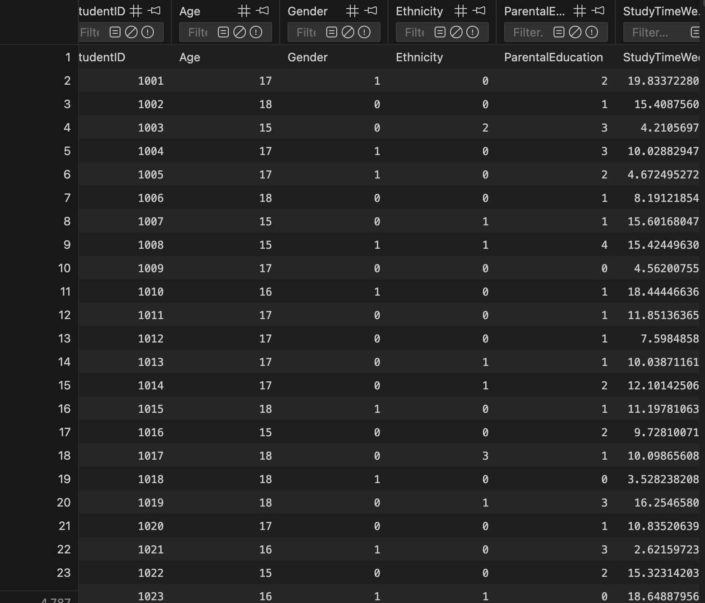

## Project Goal
Analyze student performance data to understand how factors such as
study time, parental education, and test preparation affect academic success.

## Technologies
- SQL (SQLite)
- Data modeling
- Analytical queries

## Key Questions Answered
- Does study time correlate with exam scores?
- Do test preparation courses improve results?
- Are there performance differences based on parental education?

## Key Insights
- Students who completed test prep scored on average X% higher.
- Math scores correlate more strongly with study time than reading scores.

## What I Learned
- Writing complex SQL joins
- Aggregations and grouping
- Translating real-world questions into SQL queries

## Dataset Preview

Below is a preview of the student performance dataset used in this project:

